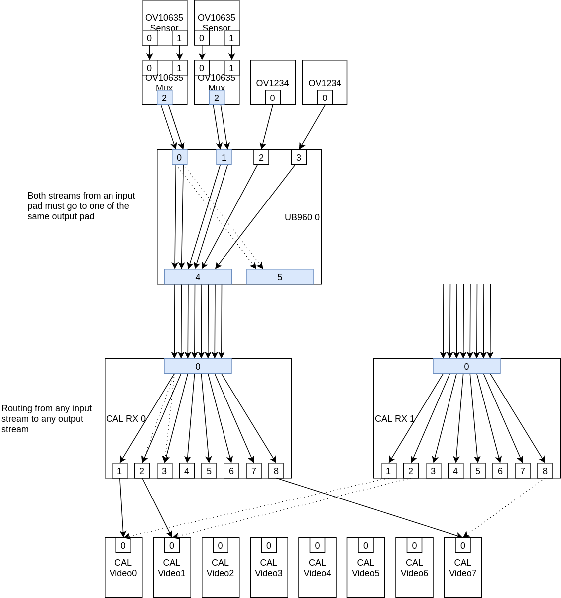

# Multiplexed streams

## Git trees

The kernel tree:

git://git.kernel.org/pub/scm/linux/kernel/git/tomba/linux.git multistream-milestone-3

DT Overlay tree:

git://git.kernel.org/pub/scm/linux/kernel/git/tomba/linux-dt.git multistream-milestone-3

kms++ tree:

git://github.com/tomba/kmsxx.git multistream-milestone-3

# V4L2

## V4L2 Device

This is the main V4L2 device that, in our case, matches the CAL platform device.

## V4L2 Subdevice

V4L2 subdevices (subdev) represent pieces of the capture pipeline. Sometimes a subdev is a single HW component, e.g. a sensor, but a subdev can also be a part of a HW block when the division makes sense. Subdevs are accessed via /dev/v4l-subdevX.

## V4L2 Video Device

Each video device represents a DMA engine which can capture a single stream. Video devices are accessed via /dev/videoX.

## Media Device

A device associated with the V4L2 device, used to manage the links between Media Entities. The media device is accessed via /dev/mediaX.

## Media Entity

Video devices and subdevices are represented as Media Entitites under Media Device.

## Media Pad

Media Pad is a single sink or source (input or output) for a Media Entity. Media Entity can have many sink and source pads.

## Media Link

Media Links link together pads between Media Entities and are often physical busses between two entities. Media Links usually carry a single stream, but with this series multiple stream can go over a single link.

Depending on the HW the Media Links are either immutable or can be enabled and disabled.

## Routing

Routing refers to subdev internal logical routing. Routing is essentially a list of tuples: (sink-pad, sink-stream, source-pad, source-stream). Sink and source pads tell the pads of the entity where the stream comes in and where it goes out. The "sink-stream" and "source-stream" are stream identifiers, used to tell the streams apart. The stream identifiers can be any numbers, i.e. they don't have any connection to virtual channel IDs or such. However, the stream identifiers must match between the source entity's source-stream and sink entity's sink-stream.

Using the routing information you can follow the stream from one end of the pipeline to the other. In some cases the routing is static, but usually the userspace must configure the routing based on the use case.

Note that routing is often quite dynamic and vague. If you think about the DS90UB960, it has 4 sink pads and 2 source pads. How many streams can there be? It is undefined, as there's no single definition of what a stream is. Consider a pixel stream from a sensor. You could say that it's a single stream. But you could also say that the first 3 lines are one stream (e.g. they might contain metadata) and the rest would be another stream. Or, going to the silly extremes, you could say that each line is a separate stream. But obviously there's no point in arbitrarily splitting pixel data into separate streams, especially if the HW doesn't have any specific support for it.

At the source-side of the pipeline it's usually easy to describe the streams: often there's just a single pixel stream, or a pixel stream and a metadata stream. With a CSI-2 camera, the pixel stream could be transferred in VC0, and the metadata in VC1. Or both could be transferred in VC0, using different CSI-2 datatypes. But CSI-2 could also easily be used to transfer 8 streams: all four VCs containing both pixel data and metadata using separate datatypes.

So, going back to DS90UB960, when DS90UB960 receives CSI-2 data to one of its sink ports, how many streams are there? The driver cannot know, so the userspace must tell it via the set_routing functionality.

## Frame desc

Frame descriptor is kernel internal data, provided via get_frame_desc from v4l2_subdev_pad_ops. get_frame_desc can be used by a driver to ask the source subdev the details about the streams it is sending. While the routing described the logical routes, without direct relation to actual HW, the frame desc describes actual details, such as virtual channel and datatype for CSI-2.

The frame descs must match the routing: If routing says that the source pad 2 of a subdev has two streams, with stream identifiers 2 and 3, then the frame desc for pad 2 must contain details for streams 2 and 3.

## Concerning Pad Configuration

In current upstream kernel the pads contain configuration such as size and pixel format. These are used to configure the pipeline.

When a pad can contain multiple streams, the above doesn't anymore make sense as there's no single configuration for a pad. This aspect of multistream support is still under discussion. My current implementation handles this so that the pad based configuration functions (e.g. v4l2_subdev_pad_ops.set_routing) is either not implemented or will return -ENOIOCTLCMD if multistream is supported. A pad with multistream support has MEDIA_PAD_FL_MULTIPLEXED flag set.

However, we still need to know the configuration for a single stream. The way to find out the configuration for a stream is to follow the stream (using routing) until a non-multiplexed pad is found, which contains the configuration. Note that you can follow the stream to either direction, sourceward or sinkward, and you should find the same configuration on both ends.

## Multistream-enabled subdev driver

The code to support multistreaming depends on the HW, but there are a some clear items that needs to be taken care of:

- Implement routing support. get_routing and set_routing must be implemented for v4l2_subdev_pad_ops, and has_route for media_entity_operations. In some cases the routing cannot be changed, and only get_routing is enough.

- Frame desc support. get_frame_desc must be implemented.

- Set MEDIA_PAD_FL_MULTIPLEXED Media Pad flag

## Multistream-enabled SoC capture driver

The implementation depends on the HW and the driver design choices, but most likely adding frame desc support is not needed (there's no sink entity needing that information). Routing support is needed, and the driver should create as many video devices as there are way to capture separate streams. CAL has 8 DMA engines, so CAL driver creates 8 video devices. If the HW can handle arbitrary amount of streams, perhaps a kernel parameter can define the amount of video devices created.

For CAL the design is:
- V4L2 device representing the platform device
- 8 video devices, representing the DMA engines
- DRA76: 2 CameraRX subdevices representing the CSI-2 receivers
- AM6: 1 CameraRX subdevice representing the CSI-2 receiver

Each of the CameraRX subdevs have a single sink pad and 8 source pads. To capture a stream, a video device has to be linked to a source pad on either of the RX subdevs. The routing in the subdev then needs to be changed to route a single stream to that pad.

Note: CAL has 8 DMA engines, but both RX subdevs could produce 8 streams, so 16 in total. Thus not all possible streams can be captured on DRA76.

## Metadata Capture

Sensors can provide embedded data (metadata) either above or below the actual pixel content for each frame. The sensor driver must implement support for metadata by implementing two subdevs. One subdev is the source device, and has two source pads, one for pixel data and one for metadata. The other subdev is a mux device, which has two sink pads and one source pad. The mux subdev combines the two input streams to the source pad.

This somewhat artificial design is needed due to V4L2 architecture: we need to have non-multiplexed pads somewhere for configuring the size, pixel format, etc. The sensor's source subdev provides this.

To associate a captured metadata frame to a captured pixel data frame, the user can look at vb2_v4l2_buffer.sequence field, which contains the CSI-2 frame number received from the sensor.

## Concerning user space

- The userspace doesn't see or configure virtual channel IDs or datatypes, they are internal to the kernel.
- The userspace must configure a "stream", which starts from a non-multiplexed pad in a sensor, and goes to a video device by configuring the non-multiplexed pads and the routing on all subdevs along the pipeline.

There is no single way to manage complex capture pipelines in userspace. Writing generic code that would handle all kinds of HW setups is not possible.

My test application (cam-mplex.py) does something along these lines:

The app contains definitions for the streams for different hardware setups. A stream definition contains the entities, source and sink pads, stream identifiers and possible pad configurations which together create a single stream. A set of stream definitions describe the configuration we want, e.g. we may have four stream definitions, of which two define pixel streams from two different cameras, and two define metadata streams from those cameras.

Based on the definitions, the app does the following:

- Disable all links (to ensure nothing extra is kept enabled)
- Use the stream definitions to:
  - Enable links between entities.
  - Set routes for subdevs
  - Set pad configurations

## Userspace tools

No changes wrt. routing has yet been made to the standard v4l tools. To use multistream support you have to write an application using the new features (routing).

For my work I have used tools I'm most familiar with: kms++ library with python bindings. I have added C++ classes for the required v4l features, and added python bindings for them. I have a small python application (py/tests/cam-mplex.py) that sets up the pipeline for 2 cameras, a pixel and metadata stream from each, and shows the data on screen using four DSS planes (Note: this only works on DRA76, as AM6 has only 2 planes. Note 2: DRA76 has 3 planes that support YUV formats, so one of the planes uses RGB565 mode for showing YUV data).

Most of this work is not polished at all, e.g. errors may crash the app, etc.

The standard v4l2-ctl and media-ctl tools can be used to test or change many things in the pipeline, so even if they are missing routing support they can still be used as part of testing. If using v4l2-ctl and media-ctl is needed, a simple way to solve the missing routing support would be to write a simple C-application which only does routing configuration. Together with v4l2-ctl and media-ctl, these tools provide all the userspace features needed to use multiplexed streams.

I also have a small python script (mc-print.py) to print media entities and links. It's a bit similar to "media-ctl -p", but shows only the enabled parts of the media tree, which I find much more readable.

## Important note about CAL driver

CAL driver is an old driver and adding Media Controller (MC) support and multiplexed streams support along the legacy behavior has proven to be very difficult. The solution has been to add two kernel module parameters, which change how the driver behaves.

- cal_mc_api - enable MC support
- cal_streams_api - enable multiplexed streams support (depends on MC support)

Of these, cal_mc_api is almost definitely going to stay, as non-MC and MC APIs are incompatible and the driver has to choose which one to support. I am still hoping to get rid of cal_streams_api, and let the driver decide at run-time how its pads will behave, but so far we haven't figured out a good way to manage this.

So, to use multiplexed stream support, remember to set both cal_mc_api and cal_streams_api to 1.

## About the HW setup

Two platforms have been used: 1) DRA76 EVM + fusionboard, and 2) AM6 EVM + UB960 EVM. In many ways the setups are very similar. The main difference is that fusionboard has two UB960 ICs, each connected to a CSI-2 connector in DRA76, whereas UB960 EVM has a single UB960.

The camera modules are UB913 with OV10635, which is a parallel sensor. There is no metadata. Metadata is simulated via UB960 configuration: UB960 can be configured to use metadata-datatype for the first 1 to 3 lines of pixel data. To enable this, hacks have been added to both the OV10635 and the UB960 drivers.

As we don't have any real metadata in this HW setup, I have not been able to add proper metadata formats. Instead in a hack patch I add generic 8 and 16-bit metadata formats which I used to test the metadata capture.

OV10635 is a black box with lacking documentation, but at least I have gotten the relevant resolutions to work (1280x720@30 and 752x480@30).

## DRA76 HW parts
- DRA76 EVM
- Fusionboard (Fusion Application Bd, EVM577PFUSION-V1-0)
- Camera: Enclosed FPD-Link III Serializer, Kit (SDI Part #: 703817-0001)

## AM6 HW parts
- AM6 EVM
- UB960 EVM (DS90UB960-Q1EVM)
- Camera: Enclosed FPD-Link III Serializer, Kit (SDI Part #: 703817-0001)

## The Kernel branch

I have grouped the commits in the kernel branch below empty "banner" commits (e.g. "========================= DT Changes =========================").

Brief descriptions about the groups:

### Hacks

These contain small hacks or fixes needed in my setup. Not really related to the work here, and you can ignore these unless you have the exact same HW setup as I have.

### DT Changes

OV5640 sensor was included in the EVM dts files, which is incorrect. Remove it from the dts so that we can add different configurations via DT overlays.

### V4L2 Core

Changes to media controller or v4l2 core. These add the routing support to the framework.

### Test Drivers

Drivers for the fpdlink deserializer (UB960), serializer (UB913) and OV10635 sensor used in my HW setup. None of these are upstream quality, and especially the OV10635 driver is a pure hack, as the sensor does not actually support metadata even if we fake it.

### CAL

These CAL patches slowly transform the driver to support all 8 DMA engines and adding plumbing for multiple streams and metadata, and finally support for metadata and multiple streams.

Note that the driver should function as before until the very last commit ("media: ti-vpe: cal: add multiplexed streams support"). This last commit finally brings everything together, changing the driver to create 8 device nodes, adding full routing and multistream support.

Note the hack patch, which can be dropped if there is a proper metadata format available:
- HACK: cal: add fake metadata formats

## The DT overlay branch

The DT overlay tree contains overlays for both DRA76 and AM6. The overlays are very similar between the EVMs, but not the same.

OV5640 commits add ov5640 support (i.e. the old dts functionality). Don't use with fpdlink.

The FPDLink overlays are split to a base fpdlink overlay and camera overlays. You need to first apply the base and then a number of camera overlays. For example:

dra76-evm-fpdlink.dtbo + dra76-evm-fpdlink-camera-0-0.dtbo dra76-evm-fpdlink-camera-0-1.dtbo

gives you dra76 with fusion board with two cameras, connected to the first two ports of the first UB960 on the fusioncard.

## The pic

# Going forward

These changes are not in upstream kernel yet. Discussions on the details continues. This means that they may still be big changes to the userspace API and possibly to the drivers.

I have another branch with an approach that changes subdev format ioctls to additionally take stream-identifier as a parameter, instead of only the pad. This makes it possible to configure each subdev independently, configuring formats for each pad-stream tuple. I like the pad-stream approach better than the one in this milestone, but the pad-stream approach was rejected in upstream discussions some years back. No one seems to rembember the reason, and I'm inclined to try again with the pad-stream approach.
